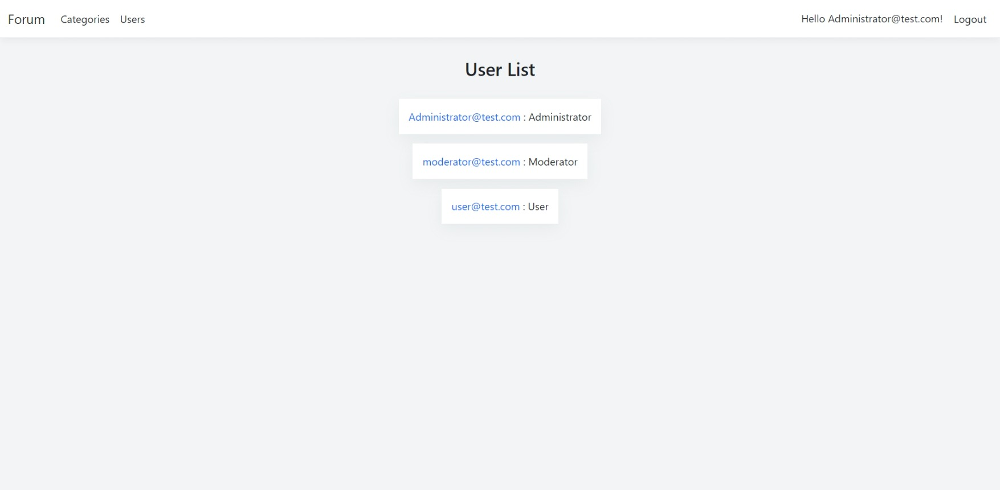

  
<h2>Screenshots from app</h2>

  

    
Categories

    </img>
  

  

    
Posts

    </img>
  

  

    
Post

    </img>
  

  

    
Post Form

    </img>
  

  

    
User Page

    </img>
  

  

    
Users

    </img>
  

